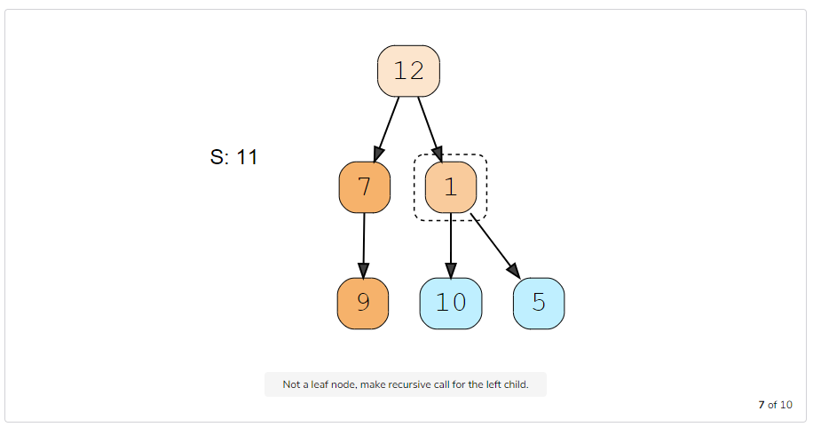

# Binary Tree Path Sum (easy)

#### Problem Statement <a href="#problem-statement" id="problem-statement"></a>

Given a binary tree and a number ‘S’, find if the tree has a path from root-to-leaf such that the sum of all the node values of that path equals ‘S’.

| Example 1                                                                                  |
| ------------------------------------------------------------------------------------------ |
| <p>S: 10</p><p>Output: true</p><p>Explaination: The path with sum '10' is highlighted.</p> |

<figure><figcaption></figcaption></figure>

| Example 2                                                                                        |
| ------------------------------------------------------------------------------------------------ |
| <p>S: 23</p><p>Output: true</p><p>Explanation: The path with sum '23' is highlighted.</p>        |
| <p>S: 16</p><p>Output: false</p><p>Explanation: There is no root-to-leaf path with sum '16'.</p> |

<figure><figcaption></figcaption></figure>

#### Solution <a href="#solution" id="solution"></a>

As we are trying to search for a root-to-leaf path, we can use the **Depth First Search (DFS)** technique to solve this problem.

To recursively traverse a binary tree in a DFS fashion, we can start from the root and at every step, make two recursive calls one for the left and one for the right child.

Here are the steps for our Binary Tree Path Sum problem:

1. Start DFS with the root of the tree.
2. If the current node is not a leaf node, do two things:
   * Subtract the value of the current node from the given number to get a new sum => `S = S - node.value`
   * Make two recursive calls for both the children of the current node with the new number calculated in the previous step.
3. At every step, see if the current node being visited is a leaf node and if its value is equal to the given number ‘S’. If both these conditions are true, we have found the required root-to-leaf path, therefore return `true`.
4. If the current node is a leaf but its value is not equal to the given number ‘S’, return false.

Let’s take the example-2 mentioned above to visually see our algorithm:

<figure><figcaption></figcaption></figure>

<figure><figcaption></figcaption></figure>

<figure><figcaption></figcaption></figure>

<figure><figcaption></figcaption></figure>

<figure><figcaption></figcaption></figure>

<figure><figcaption></figcaption></figure>

<figure><figcaption></figcaption></figure>

<figure><figcaption></figcaption></figure>

<figure><figcaption></figcaption></figure>

<figure><figcaption></figcaption></figure>

#### Code # <a href="#code" id="code"></a>

Here is what our algorithm will look like:

```
// Insert your code here
```

> Output
>
> Tree has path: true&#x20;
>
> Tree has path: false
>
>
>
> **Time complexity #**
>
> The time complexity of the above algorithm is O(N), where ‘N’ is the total number of nodes in the tree. This is due to the fact that we traverse each node once.
>
> **Space complexity #**
>
> The space complexity of the above algorithm will be O(N) in the worst case. This space will be used to store the recursion stack. The worst case will happen when the given tree is a linked list (i.e., every node has only one child).
